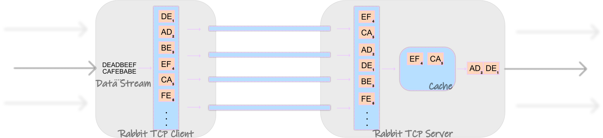

# Rabbit TCP


A multi-connection TCP forwarder

This work is an extension of [shadowsocks-magic](https://github.com/ihciah/go-shadowsocks-magic).



## Usage
1. Embedded in golang programs, use `client.Dial` as `net.Dial`.
2. Work as a standalone proxy.
## Examples

### Standalone

#### Run a server

Modify `docker-compose-server.yml` (You can find this file in this repo):
```yaml
rabbit-server:
  image: ihciah/rabbit
  ports:
    - "9891:9891/tcp"
  environment:
    - MODE=s
    - PASSWORD=dogdog
    - RABBITADDR=:9891
    - VERBOSE=2
  restart: always
```

Then run:
```bash
docker-compose -f docker-compose-server.yml up -d
```

#### Run a client

Modify `docker-compose-client.yml` (You can find this file in this repo):
```yaml
rabbit-client:
  image: ihciah/rabbit
  ports:
    - "9892:9892/tcp"
  environment:
    - MODE=c
    - PASSWORD=dogdog
    - RABBITADDR=your.server:9891
    - LISTEN=:9892
    - DEST=your.service:port
    - TUNNELN=6
    - VERBOSE=2
  restart: always
```

Then run:
```bash
docker-compose -f docker-compose-client.yml up -d
```

### Embedded
```go
package main
import (
    "fmt"
    "bufio"
    "github.com/ihciah/rabbit-tcp/client"
    "github.com/ihciah/rabbit-tcp/logger"
    "github.com/ihciah/rabbit-tcp/server"
    "github.com/ihciah/rabbit-tcp/tunnel"
)

func runAsClient() {
    cipher, _ := tunnel.NewAEADCipher("CHACHA20-IETF-POLY1305", nil, "password")
    tunnelN := 6
    addr := "your.server:port"
    c := client.NewClient(tunnelN, addr, cipher)
    
    conn := c.Dial("golang.org:80")
    fmt.Fprintf(conn, "GET / HTTP/1.0\r\n\r\n")
    status, err := bufio.NewReader(conn).ReadString('\n')
    fmt.Println(status, err)
}

func runAsServer() {
    cipher, _ := tunnel.NewAEADCipher("CHACHA20-IETF-POLY1305", nil, "password")
    addr := ":port"
    s := server.NewServer(cipher)
    s.Serve(addr)
}

```